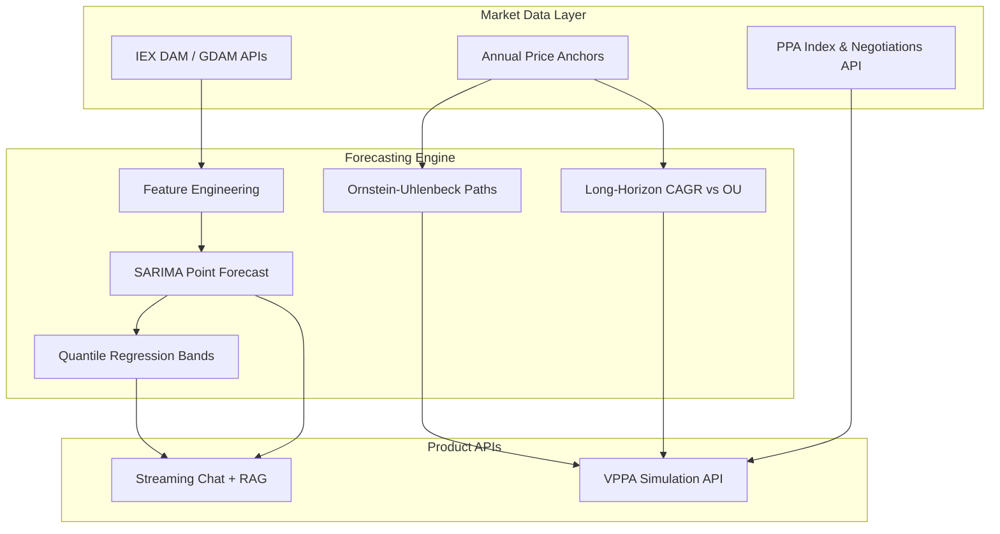
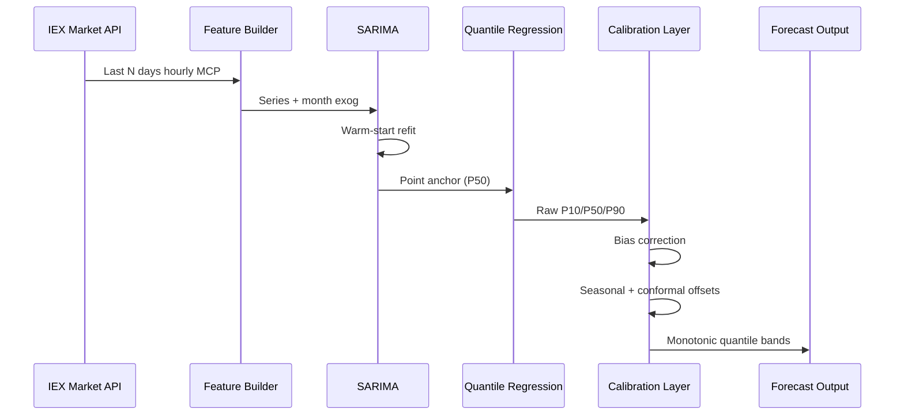
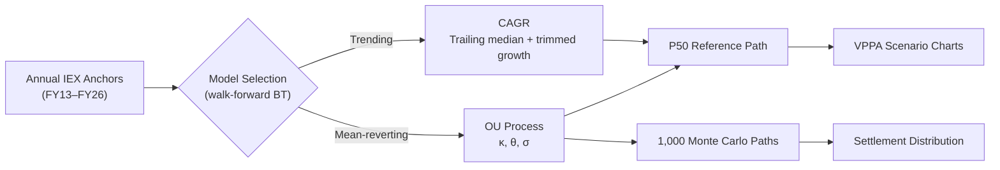
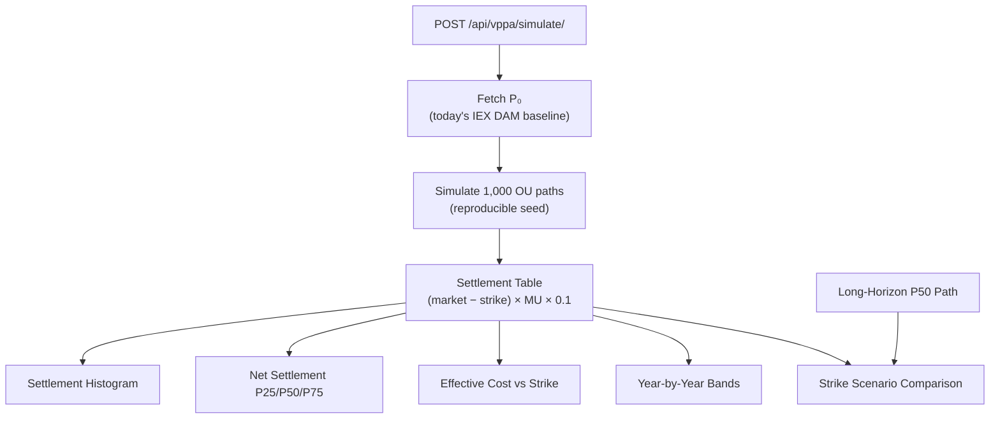
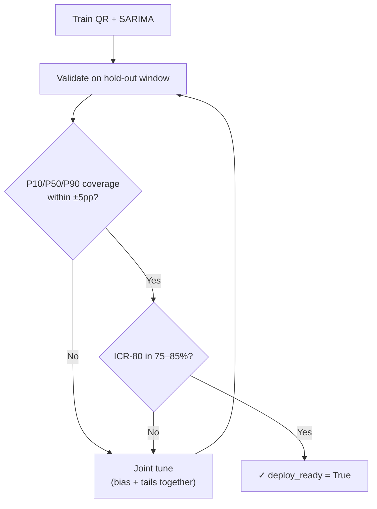
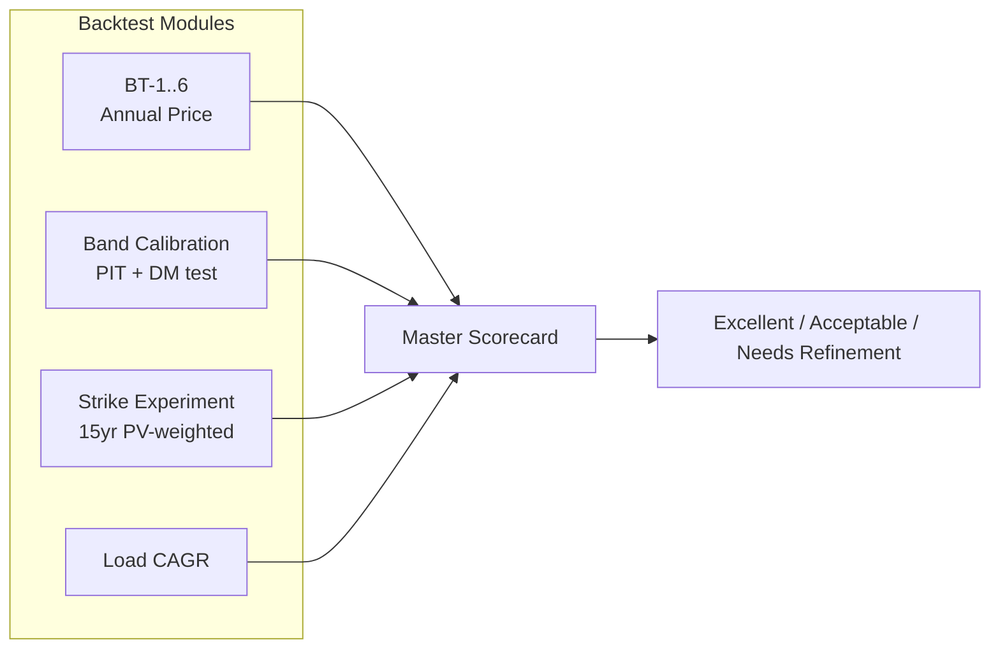
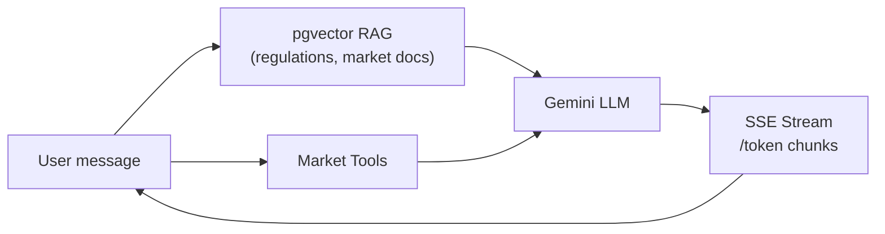

> **Portfolio overview** — Full source code is maintained in a private repository.
> This public repo contains the project documentation, architecture, and model validation details only.

# Energy Market Forecasting & VPPA Analytics Backend

A production-grade Django backend for **Indian electricity market analytics** — combining
statistical price forecasting, probabilistic uncertainty bands, long-horizon market modeling,
and **Virtual Power Purchase Agreement (VPPA)** Monte Carlo simulation. Exposed via REST APIs
and a retrieval-augmented AI assistant.

---

## Demo Video

**[▶ Watch model visualization demo](https://github.com/SOHAM240104/energy-forecasting-overview/blob/main/assets/forecasting-demo.mp4)**

Walkthrough of the forecasting pipeline, probabilistic price bands, and VPPA simulation outputs. Opens in GitHub’s built-in video player.

---

## Table of Contents

1. [Demo Video](#demo-video)
2. [Why This Exists](#why-this-exists)
3. [System at a Glance](#system-at-a-glance)
4. [Architecture](#architecture)
5. [Forecasting Pipeline](#forecasting-pipeline)
6. [Model Stack](#model-stack)
7. [VPPA Simulation Engine](#vppa-simulation-engine)
8. [Validation & Accuracy](#validation--accuracy)
9. [AI Assistant](#ai-assistant)
10. [Tech Stack](#tech-stack)
11. [Project Structure](#project-structure)
12. [Getting Started](#getting-started)
13. [Training Pipeline](#training-pipeline)
14. [API Reference](#api-reference)
15. [Deployment](#deployment)

---

## Why This Exists

Corporate energy buyers, developers, and analysts need more than a single price point. They need:

| Need | What this system delivers |
|------|---------------------------|
| **Short-term planning** | 24-hour IEX DAM forecasts with P10/P50/P90 bands |
| **Long-term contracting** | 10–15 year annual price paths (CAGR vs mean-reversion) |
| **VPPA risk** | 1,000-path Monte Carlo settlement distributions |
| **Negotiation support** | Strike price scenario comparison with reproducible seeds |
| **Explainability** | Deploy gates, backtests, and audit-safe AI guardrails |

---

## System at a Glance



---

## Architecture

### Layered design

```
┌─────────────────────────────────────────────────────────────────────────┐
│                        External Market APIs                              │
│              IEX DAM hourly · Annual anchors · PPA contracts             │
└───────────────────────────────────┬─────────────────────────────────────┘
                                    │
        ┌───────────────────────────┼───────────────────────────┐
        ▼                           ▼                           ▼
┌───────────────┐         ┌─────────────────┐         ┌─────────────────┐
│ apps/forecast │         │    apps/vppa    │         │  apps/chatbot   │
│  Production   │         │  Sim + REST API │         │  RAG + LLM tools│
│     ML        │         │                 │         │                 │
└───────┬───────┘         └────────┬────────┘         └────────┬────────┘
        │                          │                           │
        │  SARIMA + QR bands       │  OU Monte Carlo           │  get_forecast()
        │  OU / long-horizon       │  settlement math          │  market stats
        ▼                          ▼                           ▼
┌─────────────────────────────────────────────────────────────────────────┐
│                   tools/forecasting/  (offline ops)                    │
│     train · tune-joint · pipeline · backtest · research · notebooks      │
└───────────────────────────────────┬─────────────────────────────────────┘
                                    ▼
┌─────────────────────────────────────────────────────────────────────────┐
│              apps/forecasting/artifacts/*.pkl  (trained weights)         │
└─────────────────────────────────────────────────────────────────────────┘
```

| Layer | Path | Responsibility |
|-------|------|----------------|
| Production inference | `apps/forecasting/` | Live forecasts, bands, OU fit, long-horizon paths |
| VPPA product | `apps/vppa/` | Simulation engine + Django REST endpoint |
| Offline ML ops | `tools/forecasting/` | Training, calibration, backtests, research CLI |
| Artifacts | `apps/forecasting/artifacts/` | Pickled model weights (generated offline) |
| AI layer | `apps/chatbot/` | RAG, streaming chat, market tool integration |

---

## Forecasting Pipeline

### Hourly inference flow



**Pipeline steps (production):**

1. Fetch recent hourly IEX DAM clearing prices (₹/kWh)
2. Fit SARIMAX with saved warm-start parameters + month dummies
3. Apply bias correction (24h / 7d components)
4. Predict quantile bands via trained QR coefficients
5. Anchor bands to SARIMA mean; enforce monotonicity (P10 ≤ P50 ≤ P90)
6. Apply seasonal calibration and conformal coverage offsets
7. Fallback to residual bootstrap if QR weights unavailable for a region

### Probabilistic band visualization (conceptual)

```
Price (₹/kWh)
  │
5.2│                              ╭──── P90 (optimistic)
  │                         ╭────╯
5.0│                    ╭────╯──── P50 (median)
  │               ╭────╯
4.8│          ╭────╯──────────── P10 (conservative)
  │     ╭────╯
4.6│─────╯
  └─────┬─────┬─────┬─────┬─────┬─────► Time (hours)
       h+1   h+6   h+12  h+18  h+24

  ░░░░░ = 80% prediction interval (P10–P90)
  ───── = SARIMA point forecast anchor
```

---

## Model Stack

### Short-term models

| Model | Role | Key idea |
|-------|------|----------|
| **SARIMAX** | Point forecast | Seasonal ARIMA with month exogenous dummies; warm-started from offline training |
| **Quantile Regression** | P10 / P50 / P90 bands | Pinball-loss trained quantiles anchored to SARIMA mean |
| **EGARCH** | Volatility (optional) | Conditional variance for simulation-based uncertainty |
| **Bootstrap fallback** | Band backup | Residual resampling when QR unavailable |

### Long-term models



| Model | Parameters | Best when |
|-------|------------|-----------|
| **CAGR** | Base price + compound growth rate | Post-structural-break trending windows |
| **Ornstein–Uhlenbeck** | κ (speed), θ (equilibrium), σ (volatility) | Mean-reverting markets |

**OU dynamics (annual step):**

```
P(t+1) = P(t) + κ(θ − P(t)) + σ·Z     where Z ~ N(0,1)

  κ  → how fast prices revert to long-run average θ
  θ  → equilibrium price (₹/kWh)
  σ  → annual volatility shock
```

### Public Python API

```python
from apps.forecasting import get_forecast, reload_qr_weights

reload_qr_weights()
result = get_forecast(state="National")
# → 24h point forecast + P10/P50/P90 bands + chart payload
```

---

## VPPA Simulation Engine

One API call runs the full contract risk analysis and returns JSON for every dashboard tab.

### Simulation flow



### Settlement math

```
annual_MU  = contracted_MW × load_factor × 8760 / 1000    (million units / year)
settlement = (market_price − strike_price) × annual_MU × 0.1   (₹ Crore)

Sign convention:
  +  buyer receives   (market above strike)
  −  buyer pays dev   (market below strike)
```

### Example output shape

```
Cumulative Settlement (₹ Cr) over 15-year tenor
  │
  │     ▓▓▓
  │   ▓▓▓▓▓▓▓
  │ ▓▓▓▓▓▓▓▓▓▓▓        ← histogram of 1,000 simulated paths
  │▓▓▓▓▓▓▓▓▓▓▓▓▓▓
  └────────────────────────────► ₹ Cr
        P25    P50    P75
       −12    +4.2   +18
```

### Input parameters

| Field | Description | Example |
|-------|-------------|---------|
| `strike_price` | Fixed VPPA strike (₹/kWh) | 4.50 |
| `contracted_mw` | Plant capacity (MW) | 50 |
| `load_factor` | Capacity factor | 0.85 |
| `tenor_years` | Contract length | 15 |
| `n_paths` | Monte Carlo paths | 1000 |
| `seed` | Reproducibility seed | 42 |

---

## Validation & Accuracy

The system ships with a rigorous offline validation suite — models only deploy when holdout
out-of-sample metrics pass strict gates.

### Deploy gates



| Gate | Target | Acceptable range |
|------|--------|------------------|
| P50 interval coverage | 50% | 45–55% |
| P80 interval coverage (ICR-80) | 80% | 75–85% |
| P10/P90 tail coverage | ±5pp of target | — |

### Accuracy grading scorecard

Models are graded against industry-standard error metrics:

| Metric | Excellent | Acceptable | Needs refinement |
|--------|-----------|------------|------------------|
| MAPE (monthly avg) | < 5% | 5–10% | > 10% |
| MAPE (annual avg) | < 3% | 3–7% | > 7% |
| MASE | < 0.7 | 0.7–1.0 | > 1.0 |
| RMSE (₹/kWh) | < 0.30 | 0.30–0.60 | > 0.60 |
| P50 coverage | 48–52% | 45–55% | outside |
| P80 coverage | 78–82% | 75–85% | outside |
| CRPS (vs naive) | < 0.6 | 0.6–0.9 | > 0.9 |

### Backtest suite

```bash
# Full validation suite
PYTHONUNBUFFERED=1 python -m tools.forecasting.backtest all
```

| Command | Validates |
|---------|-----------|
| `price` | BT-1 … BT-6 annual price forecast backtests |
| `bands` | Probabilistic calibration, PIT uniformity, Diebold–Mariano |
| `strike` | 15-year VPPA strike price thought experiment |
| `load` | Load/demand forecast CAGR backtest |



---

## AI Assistant

Streaming LLM responses grounded in a vector knowledge base and live market tools.



**Capabilities:**
- Server-Sent Events (SSE) streaming with minimal latency
- RAG over PostgreSQL + `pgvector` document embeddings
- Multi-turn session memory (threads + turns)
- Tool calls: live DAM/GDAM stats, VWAP, P10/P50/P90, PPA fair-value bands

| Endpoint | Method | Description |
|----------|--------|-------------|
| `/chat/` | POST | Stream chat (SSE) |
| `/chat/threads/` | GET | List conversation threads |
| `/chat/threads/<id>/` | GET | Thread history |
| `/chat/suggestions/` | GET | Starter questions |

---

## Tech Stack

| Component | Technology |
|-----------|------------|
| Framework | Django 5.x, Django REST Framework |
| LLM | LangChain, Google Gemini, Google Embeddings |
| Database | PostgreSQL 15+ with `pgvector` |
| Async tasks | Celery, Redis |
| ML / Stats | pandas, numpy, scikit-learn, statsmodels, arch (EGARCH) |
| Deployment | Docker, Nginx, Supervisord, Gunicorn |

---

## Project Structure

```
.
├── apps/
│   ├── forecasting/          # Production ML library
│   │   ├── inference.py      # SARIMA + QR glue
│   │   ├── bands.py          # Quantile bands, calibration
│   │   ├── ou.py             # Ornstein-Uhlenbeck fit
│   │   ├── long_horizon.py   # CAGR vs OU comparison
│   │   └── artifacts/        # Trained .pkl weights
│   ├── vppa/                 # VPPA simulation product
│   │   ├── engine.py         # Orchestrator
│   │   ├── market.py         # OU path simulation
│   │   └── settlement.py     # Settlement math
│   ├── chatbot/              # RAG + streaming LLM
│   ├── ppa_pricing_engine/   # PPA quantile pricing ML
│   └── common/               # Auth, serializers, views
├── tools/forecasting/
│   ├── training/             # train, pipeline, tune-joint, gates
│   ├── backtest/             # BT CLI suite
│   └── notebooks/            # Validation Jupyter notebook
├── config/                   # Django settings, Celery, URLs
└── docker/deployment/        # Production Docker Compose
```

---

## Getting Started

### Prerequisites

- Python 3.12+
- PostgreSQL 15+ with `pgvector`
- Redis (Celery)
- Docker & Docker Compose (optional)

### Setup

```bash
git clone <your-repo-url>
cd energy-forecasting-backend

python3 -m venv .venv
source .venv/bin/activate
pip install -r requirements.txt
pip install -r requirements-dev.txt

cp .env.example .env
# Configure DATABASE_URL, GOOGLE_API_KEY, MARKET_API_HOST, MARKET_API_KEY, REDIS_URL

python manage.py migrate
python manage.py ingest_knowledge   # optional: populate vector store
python manage.py runserver
```

---

## Training Pipeline

```bash
# Full pipeline (seasonal cal → joint tune)
PYTHONUNBUFFERED=1 python -m tools.forecasting.training pipeline \
  --days 365 --val-days 14 --holdout-days 14

# Joint calibration only
PYTHONUNBUFFERED=1 python -m tools.forecasting.training tune-joint \
  --days 365 --val-days 7 --holdout-days 14

# Run all backtests
PYTHONUNBUFFERED=1 python -m tools.forecasting.backtest all

# Validation notebook
PYTHONUNBUFFERED=1 python tools/forecasting/scripts/run_notebook.py
```

### Model artifacts

| File | Purpose |
|------|---------|
| `quantile_regression_weights.pkl` | QR coefficients + calibration |
| `sarima_mean_weights.pkl` | SARIMA warm-start parameters |
| `egarch_var_weights.pkl` | EGARCH volatility parameters |
| `ols_adjustment_weights.pkl` | State-level OLS adjustments |

> Artifacts are gitignored — regenerate via the training pipeline above.

---

## API Reference

### VPPA Simulation

```
POST /api/vppa/simulate/
```

```json
{
  "strike_price": 4.50,
  "contracted_mw": 50,
  "load_factor": 0.85,
  "tenor_years": 15,
  "alternative_strike_price": 4.75,
  "n_paths": 1000,
  "seed": 42
}
```

Returns all dashboard tab payloads in one JSON response.

### Chat (streaming)

```
POST /chat/
Content-Type: application/json

{"message": "What is the 24h DAM forecast?", "thread_id": "optional-uuid"}
```

Returns `text/event-stream` with status updates and token chunks.

---

## Deployment

```bash
docker-compose -f docker/deployment/app.yml up --build -d
docker-compose -f docker/deployment/db.yml up -d
```

Stack: Nginx (SSL) → Gunicorn → Django, Celery workers via Redis, Supervisord.

---

## Disclaimer

This system provides **decision support and scenario analytics** for energy procurement.
It does not execute trades, provide investment advice, or guarantee market outcomes.
Forecasts are probabilistic; realised prices depend on grid conditions, regulatory changes,
and market dynamics.

---

## License

MIT — see LICENSE file.
